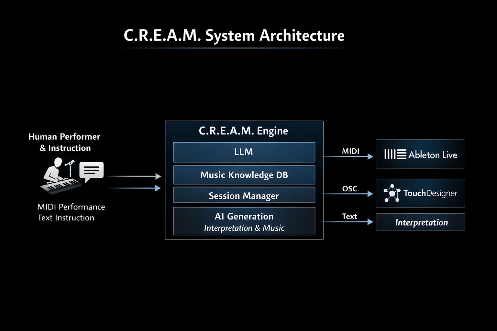

# C.R.E.A.M.

**Compositional Real-time Engine for Augmented Musicality**

# Demo

https://www.youtube.com/watch?v=PbfORgyXfn0

C.R.E.A.M. は、人間とAIがリアルタイムに音楽を即興共作するためのシステムです。  
人間のMIDI演奏、自然言語による指示、音楽知識データベースを統合し、AIが音楽フレーズ・解釈テキスト・映像制御パラメータを生成します。

---

# Overview

C.R.E.A.M. is a real-time co-creative music system in which an AI improvises together with a human performer.

The system integrates:

- Human MIDI performance
- Natural language instruction from a web interface
- Music knowledge retrieved from MusicCaps + LanceDB
- LLM-based interpretation and sequence generation

The AI outputs:

- MIDI for musical performance (Ableton Live)
- OSC for visual control (TouchDesigner)
- Interpretation text as a semantic layer of co-creation

---

# Concept

C.R.E.A.M. is not a one-shot music generation tool.

Instead of:

prompt → music

it is designed as:

human performance + human instruction + music knowledge  
↓  
AI interpretation  
↓  
musical response

This system aims to explore AI not as a mere generator, but as a **co-performer** in real-time improvisation.

---

# System Architecture



```
Human Performance (MIDI)
        +
Human Instruction (Web UI)
        ↓
        C.R.E.A.M.
(LLM + Music Knowledge + Session State)
        ↓
 ┌───────────────┬──────────────────┬────────────────┐
 │               │                  │
MIDI          OSC               Text
│               │                  │
Ableton Live   TouchDesigner     Interpretation
```


---

# Project Structure

```
cream/
├── backend/
│   ├── main.py
│   ├── config.py
│   ├── state.py
│   ├── app_context.py
│   ├── session_engine.py
│   ├── midi_io.py
│   ├── osc_output.py
│   ├── llm_generator.py
│   ├── knowledge_base.py
│   ├── feedback_store.py
│   ├── generation_store.py
│   └── requirements.txt
│
├── frontend/
│   └── Next.js control interface
│
├── data/
│   └── music_knowledge_db/
│
├── scripts/
│   └── ingest_musiccaps.py
│
├── assets/
│   └── jssa2026/
│
└── README.md
```


---

# Backend Features

- FastAPI-based control API
- Autonomous session loop
- MIDI input monitoring
- MIDI output generation
- OSC dispatch for visual systems
- Music knowledge retrieval via LanceDB
- Feedback logging
- Generation logging
- Session ID management

---

# Frontend Features

- Instruction input panel
- Live session monitoring
- Status polling
- Feedback submission
- New session control

---

# API Endpoints

## POST /chat

Update current musical instruction.

Request example

```json
{
  "message": "もっと静かに、アンビエント寄りに",
  "user_id": "local-user"
}
```


---

## GET /status

Get current C.R.E.A.M. session state.

---

## POST /feedback

Store feedback about the AI response.

Request example

Request example

```json
{
  "feedback_type": "not_reflected",
  "feedback_text": "もっと静かな雰囲気にしてほしかった"
}
```


---

## POST /session/new

Start a new improvisation session.

---

# Backend Setup

From the project root

```bash
python3 -m venv venv
source venv/bin/activate
pip install -r backend/requirements.txt
```


Run backend

```bash
python backend/main.py
```


---

# Frontend Setup

```bash
cd frontend
npm install
npm run dev
```

---

# Knowledge Base Setup

Prepare MusicCaps data and build LanceDB

For quick testing, a small sample dataset is included.

Use the sample dataset:

data_sample/musiccaps_small.csv

Run ingestion:

```bash
python scripts/ingest_musiccaps.py
```

For the full dataset:

Download the MusicCaps dataset and place it in the project root as:

musiccaps-public.csv

Then run:

python scripts/ingest_musiccaps.py

---

# Runtime Environment

C.R.E.A.M. assumes the following runtime setup

- MIDI keyboard input
- MIDI bus routing
- Ableton Live for sound output
- TouchDesigner for visual output
- LM Studio for local LLM inference
- Ollama for embedding model inference

---

# Research Context

C.R.E.A.M. is developed as a real-time AI co-creation system exploring

- human-AI improvisation
- AI as a creative collaborator
- semantic interpretation in musical performance
- music/visual co-generation in live media art

---

# Author

Takuto Okubo  
Tokyo Denki University Graduate School

---

# Project Status

Experimental / Active Development

# License

MIT License